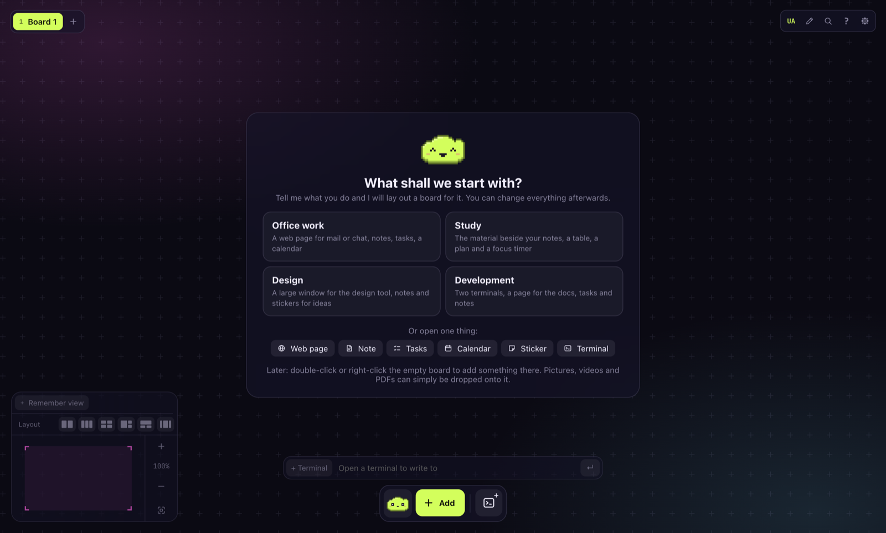

<p align="center"></p>

# Kumodesk

An infinite board for your windows. Web pages, notes, tasks, a calendar, tables, pictures and
terminals stand side by side on one board that you move around and zoom, instead of piling up
behind each other. It is made for anyone who works at a computer, not only for programmers.



## Download

Take the file for your system from the [latest release](../../releases/latest).

| System  | File                                                                 |
| ------- | -------------------------------------------------------------------- |
| macOS   | `kumodesk-…-arm64.dmg` for Apple silicon, `kumodesk-…-x64.dmg` for Intel |
| Windows | `kumodesk-…-setup.exe`                                               |
| Linux   | `kumodesk-….AppImage`, or `kumodesk_…_amd64.deb`                     |

## Install

There are two ways, and they give the same app: one command in a terminal, or a file you
download and open.

### With one command

**macOS and Linux**

```sh
curl -fsSL https://raw.githubusercontent.com/snowfallen/kumodesk-releases/main/install.sh | sh
```

**macOS with Homebrew**

```sh
brew tap snowfallen/kumodesk https://github.com/snowfallen/kumodesk-releases
brew install --cask kumodesk
```

**Windows** (in PowerShell)

```powershell
irm https://raw.githubusercontent.com/snowfallen/kumodesk-releases/main/install.ps1 | iex
```

To update, run the same command again (with Homebrew: `brew upgrade --cask kumodesk`). From
version 0.1.4 the app also looks for updates itself and asks before installing one.

### With a file

**macOS.** Open the `.dmg` and drag Kumodesk to Applications. The app is not signed yet, so
macOS refuses to start it the first time ("Apple could not verify…"). Press **Done**, then
open **System Settings → Privacy & Security**, scroll down to the line about Kumodesk and press
**Open Anyway**. This is needed once. Installing with a command above avoids this step.

**Windows.** Run the setup. If SmartScreen stops it, choose **More info**, then **Run anyway**.

**Linux.** Make the AppImage executable (`chmod +x kumodesk-*.AppImage`) and run it, or install
the `.deb` with your package manager.

## Your data

Everything you make stays on your computer, in the app's own folder. Nothing is sent anywhere.

## Something is wrong?

Tell us in [Issues](../../issues): what you did, what you expected and what happened instead.
A screenshot helps.
